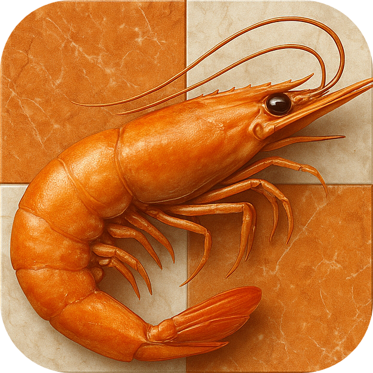

 

# 🦐 Kreveta Chess Engine

## About

An amateur, UCI-compatible chess engine written entirely in C#.
Originally developed as a hobby project, but now also serves as the
basis for my SOČ thesis. Designed to balance strength, speed and
reliability, while still aiming for code clarity and proper
documentation, making it ideal for others to study, experiment
with, or use as a foundation for future engines.
Development started on **March 3, 2025**.

---

### Elo Ratings

Kreveta has been tested and rated on numerous sites using various time controls.
Keep in mind these Elo ratings are relative to other engines, and comparing them to human ratings is useless.

| Site                                                                                                          | Time Control                   | Tested Releases     |
|---------------------------------------------------------------------------------------------------------------|--------------------------------|---------------------|
| [Lichess](https://lichess.org/@/ZlomenyMesic)                                                                 | Bullet, Blitz, Rapid, Classical | all                 |
| [CCRL](https://www.computerchess.org.uk/ccrl/404/cgi/compare_engines.cgi?family=Kreveta)                      | Blitz 2+1                      | 1.2.3, 2.0.0, 2.2.2 |
| [CCI](https://github.com/computer-chess-index/cci/blob/main/engines/Kreveta.md)                               | STC, LTC, VLTC                 | 1.2.4+              |
| [CEDR](https://chessengines.blogspot.com/search?q=kreveta)                                                    | Unknown                        | 2.0.0+              |
| [CCRAT](https://docs.google.com/spreadsheets/d/1AgE6EJw3JRBI6M4_TrdaWZcQjZy8DYqRYq71mAjNLsI/edit?gid=0#gid=0) | 80+1s                          | 1.2.3               |

---

## Engine Internals

### Move Generation

- Bitboard position representation
- Precomputed slider tables with PEXT-based lookups

### Search Features

- Principal Variation Search framework
- Quiescence search for leaf nodes
- Various pruning techniques
- Precise reductions and extensions
- Killers, capture killers and countermoves
- Quiet, capture, static eval and 2-ply continuation histories
- Pawn, king, minor and major piece corrections
- Resizable transposition table (1-2047 MiB)
- Rational time management

### Static Evaluation

- **Classical**
  - PSTs with tapering evaluation
  - Pawn structure (doubling, isolation, blocking, passed pawns)
  - King safety based on friendly protection
- **NNUE**
  - 128->16->16->1 architecture
  - 8 subnets/buckets based on piece count
  - Trained on ~143M self-play positions

### Others

- Generic Polyglot opening book support
- Adjustable playing strength based on CCRL-calibrated Elo
- Ability to play worst possible moves
- Fancy statistics printing & analysis mode
- Custom [parameter tuning](https://github.com/ZlomenyMesic/Kreveta/tree/master/KrevetaTuning) project

---

## UCI Protocol Support

Kreveta fully supports the **Universal Chess Interface (UCI)** protocol.
For a more detailed explanation, visit the [documentation](https://gist.github.com/DOBRO/2592c6dad754ba67e6dcaec8c90165bf).
Below are the implemented commands and their usage:

### `uci`

Sent by the GUI to ensure the engine uses the UCI protocol. The engine responds with `id name`, `id author`, a list of all supported options and eventually `uciok`, which lets the GUI know UCI is supported.

### `isready`

Used by the GUI to check whether the engine is ready to respond to further commands. If the engine is ready, it responds with `readyok`.

### `ucinewgame`

Signals that the engine will be playing a whole game of chess, instead of just analyzing a single position. This allows the engine to toggle various options, depending on the current task. The engine doesn't respond with anything.

### `position [fen | startpos] moves ...`

Used to set up a chess position, which must be done prior to any search. The starting position is set up using `position startpos`. Set up a position using a FEN string so: `position fen <fen_string>`. The FEN string must include the position, side to move, en passant square and castling rights. Fullmove and halfmove clocks are optional. After both startpos and FEN strings may follow a list of moves played from the position. This list must begin with the `moves` token, e.g. `position startpos moves e2e4 e7e5 g1f3`.

### `go [depth n | movetime t | wtime x btime y ...]`

Starts searching the best move from the current position. None of the arguments are mandatory, and if none are provided, the default time budget is used. All time arguments must be passed in milliseconds. Once the search terminates, the engine responds with `bestmove <m>`.

For user analysis, `depth <d>` indicates how many moves to search ahead. Using `movetime <t>` starts a search with a specified time budget. `nodes <n>` may also be used to set an upper limit for the total number of searched positions. To evaluate a single move or a selection of moves, use `searchmoves <m1 m2 ...>`. The command `go infinite` starts an infinite search, ideal for long analysis.

When playing a full game, other arguments may also be provided to specify the time control, such as `wtime <t>` and `btime <t>` indicating the time left for either side, `winc <t>` and `binc <t>` telling the time increment or `movestogo <n>` for restarting time controls.

### `stop`

Interrupts search immediately. Works both for perft and regular search.

### `quit`,`exit`

Exits the program as soon as possible. Terminating the program this way is recommended to ensure all manually allocated memory is freed properly.

### `setoption name [option] value [value]`

Changes internal engine configuration. Supported options are:

- **PolyglotUseBook** (check): enables/disables retrieving and playing moves from the specified Polyglot book
- **PolyglotBook** (string): sets the path to the Polyglot book
- **PolyglotRisk** (spin): decides how risky the engine acts when choosing from multiple differently weighted moves in the Polyglot book
- **Hash** (spin): size of the TT in MiB (other tables are not affected)
- **Clear Hash** (button): clears the TT during search
- **UsePerftHash** (check): enables/disables usage of a secondary TT for perft
- **UCI_Elo** (spin): sets an Elo rating at which the engine should perform
- **UCI_LimitStrength** (check): enables/disables the Elo limit. Must be set to true to actually allow playing strength restrictions
- **UCI_AnalyseMode** (check): enables/disables analysis mode
- **UCI_EngineAbout** (string): just some short info
- **PrintStats** (check): enables/disables prints of additional statistics at the end of search
- **PlayWorst** (check): forces playing the worst possible moves

### `perft` (non-UCI)

Stands for PERFormance Test. This command is used to measure the move generator speed and correctness. The syntax is `perft <d>`, which specifies the depth at which the test shall be performed. The output is the number of nodes found exactly at the specified depth, and the total time spent to find this number.

### `d`, `draw`, `display` (non-UCI)

Displays the currently set position, along with its FEN, internal TT hash and Polyglot hash.

### `moves` (non-UCI)

Shows all legal moves from the set position sorted by piece type.

### `eval` (non-UCI)

Prints both the classical and NNUE evaluation for the current position. Keep in mind the score is obtained without any search, and thus is unreliable and unfit for any serious purpose.

### `flip` (non-UCI)

Flips the side to move on the currently set position.

### `bench` (non-UCI)

Runs a short search on a hard-coded set of positions to measure regular search speed and the number of searched nodes. `bench <d>` may be run to override the
default search depth.

### `cls` (non-UCI)

Clears the console window.

### `tune <v1 v2 ...>` (non-UCI)

Used for tuning internal parameters. This command is not required unless you're planning on making the engine better.

### `license` (non-UCI)

Displays the content of the MIT license.

### `help`, `-help`, `--help`, `h`, `-h`, `--h` (non-UCI)

Redirects you here.

---

## Build & Run

On the [Releases page](https://github.com/ZlomenyMesic/Kreveta/releases) are available the latest stable releases of Kreveta. Download the executable, connect it to your GUI of choice and you're good to go. Kreveta performs the best on hardware supporting the BMI2 and AVX2 instruction sets, but implements fallbacks for older hardware as well.

To build Kreveta yourself, .NET SDK 9.0 or 10.0 is recommended. Clone the repository using  
`git clone https://github.com/ZlomenyMesic/Kreveta`  
or download the source code directly. A self-contained executable may be built using  
`dotnet publish -c Release -r win-x64 --self-contained true /p:PublishSingleFile=true /p:IncludeNativeLibrariesForSelfExtract=true /p:PublishTrimmed=true`
