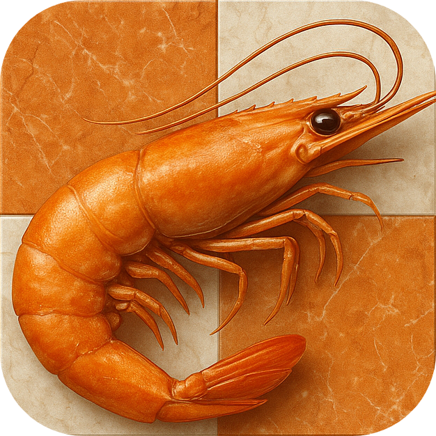

 

# 🦐 Kreveta Chess Engine

## About

A high-performance UCI-compatible chess engine written in C#.
Designed to be fast and strong, with a main focus on optimizing C# to its limits. Development started on **4/3/2025**.

---

### Elo Ratings

No official ratings yet.

Rough estimates from playtesting using [Cutechess-cli](https://github.com/cutechess/cutechess):

| Opponent        | Time Control | Games   | Elo estimate |
|-----------------|--------------|---------|--------------|
| Stockfish 17    | 40/100       | ~800    | 2381         |
| Stockfish 17    | 40/120       | ~1400   | 2362         |
| ...             | ...          | ...     | ...          |

> [!NOTE]
> Time Control is in format moves/time in seconds

---

## Benchmarks

### Regular search (initial position)

| Depth | Sel. Depth | Time (s) | Nodes Searched | NPS       | Best Move |
|-------|------------|----------|----------------|-----------|-----------|
| 5     | 15         | 0.031    | 11,392         | 367,484   | d4        |
| 10    | 22         | 0.364    | 665,708        | 1,828,868 | e4        |
| 15    | 27         | 6.828    | 13,549,138     | 1,984,349 | e4        |
| 20    | 32         | 58.48    | 324,517,712    | 2,047,715 | e3        |

> [!NOTE]
> Depth is the full depth. Selective depth is the actual achieved depth via quiescence search.

### Perft results (initial position)

| Depth | Nodes           | Time (s)     | NPS           |
|-------|-----------------|--------------|---------------|
| 1     | 20              | 00.00001     | 20,000        |
| 2     | 400             | 00.00005     | 400,000       |
| 3     | 8,902           | 00.00024     | 8,902,000     |
| 4     | 197,281         | 00.0052      | 39,456,200    |
| 5     | 4,865,609       | 00.095       | 51,216,937    |
| 6     | 119,060,324     | 01.427       | 83,434,004    |
| 7     | 3,195,901,860   | 24.147       | 132,357,403   |

---

## Engine Internals

### Move Generation

- Bitboard representation of pieces
- Magic bitboards for sliding piece attacks
- Precomputed move lookup tables

### Search Features

- Principal Variation Search with Alpha-Beta Pruning
- Quiescence search for leaf nodes
- Null Move Pruning (NMP)
- Late Move Pruning (LMP) and Reductions (LMR) relative to history
- Futility Pruning (FP) and Delta Pruning for QSearch
- Mate Distance Pruning (MDP)
- Move ordering based on TT, MVV-LVA and others
- Killer move table + countermove heuristics
- Quiet history and pawn corrections
- Improving search stack
- Resizable Transposition Table (1-1000 MB)
- Rational time management

### Static Evaluation

- Piece-Square Tables with tapering evaluation
- Pawn structure eval (doubling, isolation, connection, blocking)
- Bishop pairs and open-file rooks
- Tapering evaluation for knights and rooks
- King safety based on protecting pieces

### Others

- Generic Polyglot opening book support
- [NeoKolors](https://github.com/KryKomDev/NeoKolors) library for logging UCI communication

---

## UCI Protocol Support

Kreveta fully supports the **Universal Chess Interface (UCI)** protocol.
For a more detailed explanation, visit the [documentation](https://gist.github.com/DOBRO/2592c6dad754ba67e6dcaec8c90165bf).
Below are the implemented commands and their usage:

### `uci`

Sent by the GUI to ensure the engine uses the UCI protocol. The engine responds with `id name`, `id author`, a list of all supported options and eventually `uciok`, which lets the GUI know UCI is supported.

### `isready`

Used by the GUI to check whether the engine is ready to respond to further commands. If the engine is ready, it shall respond with `readyok`.

### `ucinewgame`

Signals that the engine will be playing a whole game of chess, instead of just analyzing a single position. This allows the engine to toggle various options, depending on the current task. The engine doesn't respond with anything.

### `position [fen | startpos] moves ...`

Used to set up a chess position, which must be done prior to any search. The starting position is set up using `position startpos`. Set up a position using a FEN string so: `position fen <fen_string>`. The FEN string must include the position, side to move, en passant square and castling rights. Fullmove and halfmove clocks are optional. After both startpos and FEN strings may follow a list of moves played from the position. This list must begin with the `moves` token, e.g. `position startpos moves e2e4 e7e5 g1f3`.

### `go [depth n | movetime t | wtime x btime y ...]`

Starts searching the current position. None of the arguments are mandatory, and if none are provided, the default time budget is used. `wtime` indicates white's time left, `btime` is black's time left, `winc` tells white's time increment after each move and `binc` is black's time increment. The search can also be run as `go movetime <x>`, which precisely specifies the time the search should take. `go depth <x>` runs a search with unrestricted time, but a strict maximum search depth. `go infinite` starts a neverending search. All time arguments shall be passed in milliseconds.

### `stop`

Interrupts search immediately. Works both for perft and regular search.

### `setoption name [option] value [value]`

Changes engine configuration. Available options:

- **PolyglotUseBook** (check): enables/disables retrieving and playing moves from the specified Polyglot book
- **PolyglotBook** (string): sets the path to the Polyglot book
- **PolyglotRisk** (spin): decides how risky the engine will play when choosing from multiple differently weighted moves in the Polyglot book
- **Hash** (spin): size of the TT in megabytes (other tables are not affected)
- **NKLogs** (check): enables/disables logging all UCI communication into an external log file
- **PrintStats** (check): enables/disables printing fancy statistics at the end of regular and perft searches

### `quit`

Shuts down the engine immediately.

### `perft` (non-UCI)

Stands for PERFormance Test. This command is used to measure the move generation algorithm's speed and correctness. The syntax is `perft <x>`, which specifies the depth at which the test shall be performed. The output is the number of nodes found exactly at the specified depth and the total time spent to find this number.

### `d` (non-UCI)

Prints the currently set position.

### `cls` (non UCI)

Clears the console window.

### `bench` (non-UCI)

Runs current benchmarks.

### `help` (non-UCI)

Redirects you here.

---

## Build & Run